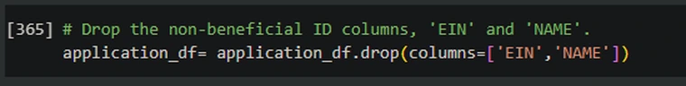
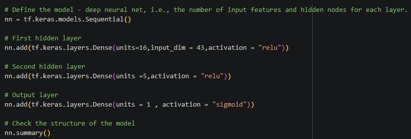
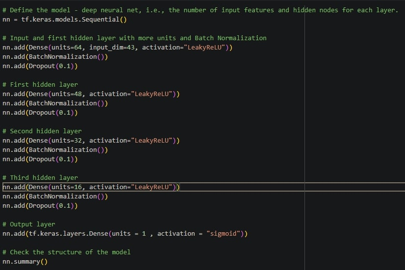
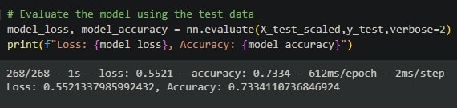

# Alphabet Soup Funding Model

## Overview of the Analysis

# Alphabet Soup Funding Model
* The nonprofit foundation Alphabet Soup wants a tool that can help it select the applicants for funding with the best chance of success in their ventures. With your knowledge of machine learning and neural networks, you’ll use the features in the provided dataset to create a binary classifier that can predict whether applicants will be successful if funded by Alphabet Soup.

# Data Preprocessing
#### What variable(s) are the target(s) for your model?
* The 'IS_SUCCESSFUL' column from application_df is the target variable, this is what we are trying to predict. This shows if the money was used effectively.
  
#### What variable(s) are the features for your model?
* The feature variables we used are:
  1. AFFILIATION—Affiliated sector of industry
  2. CLASSIFICATION—Government organization classification
  3. USE_CASE—Use case for funding
  4. ORGANIZATION—Organization type
  5. STATUS—Active status
  6. INCOME_AMT—Income classification
  7. SPECIAL_CONSIDERATIONS—Special considerations for application
  8. ASK_AMT—Funding amount requested

#### What variable(s) should be removed from the input data because they are neither targets nor features?
* Identification columns: The "EIN" and "NAME" columns are identification columns that typically provide unique identifiers for each organization. These columns usually have no direct impact on the target variable and can be dropped without affecting the model's accuracy.

### Compiling, Training, and Evaluating the Model

#### How many neurons, layers, and activation functions did you select for your neural network model, and why?
* In my first neural network model, I used a two-layer architecture with a specific choice for the number of neurons, layers, and activation functions.

* By selecting 16 neurons in the first hidden layer (units_1 = 16), 5 neurons in the second hidden layer (units_2 = 5), and using the ReLU activation function  and (activation="relu") for both hidden layers, you aimed to create a model with sufficient complexity to capture and learn meaningful patterns in the data. The choice of ReLU activation helps introduce non-linearity and allows the model to learn complex relationships between the input features and the target variable.

* Additionally, you used a single neuron in the output layer (units=1) with a sigmoid activation function (activation="sigmoid") to model the binary classification problem. The sigmoid activation function maps the output to a range between 0 and 1, representing the probability of the positive class.

* In summary, the model architecture with the chosen number of neurons, layers, and activation functions aimed to strike a balance between complexity and simplicity, allowing the model to learn and generalize well on the given classification task.

#### Were you able to achieve the target model performance?
* As you can see below I was only able to achieve 72%, which was not the target model performance which was 75%. 

#### What steps did you take in your attempts to increase model performance?
1. Increasing the number of epochs
2. Add More Layers and Neurons
3. Try different models such as 'LeakyReLU', 'ELU', relu and a few others 
   

* Increasing the number of epochs gives the model more opportunities to learn from the data and adjust the weights. It allows the model to refine its predictions and find better parameter values, which can lead to improved accuracy. However, it's important to find a balance as increasing epochs excessively can lead to overfitting.

* When retrying the model with any number of epochs the best output I could manage to get was 74%

2. Adding more layers and nuerons to the model:

* This was the area I fiddled with the most and in the end it didn't really bear any fruit and the final result despite adding more and more compexity to the deep neural network it really didn't work any better. I first added 2 more hidden layers and a whole bunch of neurons to each layer but despite all of that it still only ended up with 72-74% 
* I also attempted to use a bunch of different models such as LeakyReLU but to no avail while it didn't appear to make the model worse it didn't improve it.
  

## Conclusion: Enhancing Deep Learning Model Performance

Despite the significant efforts put into developing the deep learning model, its accuracy plateaued at 73%. For future enhancements, several strategies are proposed to potentially increase this metric. These strategies are aimed at refining the model's learning capacity and its generalization to unseen data. The recommended steps are as follows:

- **Expand the Dataset**:
  - Enriching the dataset could substantially benefit the model. A larger, more varied dataset allows for improved generalization, as the model would be trained on a broader spectrum of examples. Efforts should be made to gather more data pertinent to the problem at hand, enhancing the model's predictive precision.

- **Improve Data Preprocessing**:
  - The integrity of the input data is crucial. This encompasses meticulous data cleaning efforts such as dealing with missing values, outliers, and feature scaling. A thorough review and cleaning process could significantly diminish the influence of noise and irrelevant information, thereby potentially boosting the model's accuracy.

- **Experiment with Different Algorithms**:
  - Venturing into alternative machine learning algorithms, such as the Random Forest classifier, could provide fresh insights. Random Forest, in particular, offers an analysis of feature importance, highlighting the most significant predictors. This could inform a more focused approach, honing in on the attributes that truly matter.

- **Focus on Feature Importance**:
  - Understanding which features most strongly influence the model's decisions is key. By pinpointing and prioritizing these features, the model can be streamlined, reducing unnecessary complexity and enhancing its ability to discern meaningful patterns.

- **Address Bias and Outliers**:
  - The presence of bias and outliers can distort the model's learning, leading to suboptimal performance. Strategies such as outlier detection and data transformation can be employed to mitigate their effects, paving the way for more accurate predictions.

- **Implement Data Binning**:
  - For certain types of data, binning continuous variables can simplify their relationship with the target outcome. This can make the model more resilient to data variability, possibly improving predictive accuracy.

In essence, elevating the model's performance will involve a multifaceted approach: expanding and refining the dataset, exploring diverse algorithms, emphasizing key features, correcting biases, and employing data binning where beneficial. It's a process of continuous iteration and refinement, with each step geared towards enhancing the model's predictive capabilities in solving the classification problem.

